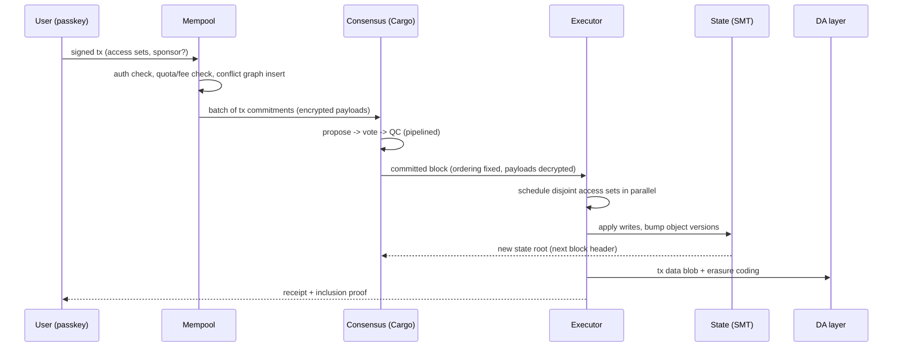
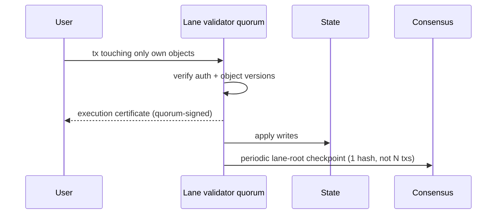

# Phi Technical Architecture & Component Breakdown

> Companion to [SPECIFICATION.md](./SPECIFICATION.md).

## 1. Language Choices

| Layer | Language | Justification |
|---|---|---|
| Node core (consensus, networking, state, VM host) | **Rust** | Memory safety without GC pauses (critical for consensus timing), fearless concurrency for parallel execution, mature crypto/WASM ecosystem (`ed25519-dalek`, `blake3`, `wasmtime`), formal-verification tooling (Kani, Prusti) |
| Smart contracts | **Rust → WASM** (first-class), AssemblyScript later | One toolchain for node and contracts; deterministic WASM subset |
| ZK circuits | Rust (arkworks / plonky3) | Shared types with node; STARK-friendly PQ path |
| Tooling/SDKs | TypeScript + Rust | Web developer reach |

Go was considered for the node (faster iteration) but rejected: GC pauses and
weaker control over memory layout hurt the parallel executor and proving
pipeline. Go remains a good choice for auxiliary services (indexers, faucets).

## 2. Codebase Directory Structure

```
phi/
├── Cargo.toml                  # workspace root
├── crates/
│   ├── phi-types/              # core types: blocks, txs, objects, accounts, crypto newtypes
│   ├── phi-crypto/             # hashing, signatures, VRF, (later) threshold BLS
│   ├── phi-state/              # object store, sparse Merkle tree, versioning
│   ├── phi-vm/                 # PhiVM host: wasmtime embedding, gas metering, ABI
│   ├── phi-mempool/            # admission, access-set conflict graph, lane routing
│   ├── phi-consensus/          # Cargo: pacemaker, vote aggregation, QC, sortition
│   ├── phi-executor/           # parallel scheduler (owned fast path + shared ordered path)
│   ├── phi-da/                 # erasure coding, blob store, sampling client
│   ├── phi-p2p/                # libp2p networking: gossip, sync, RPC
│   ├── phi-node/               # node binary wiring all components
│   └── phi-sim/                # local multi-node simulation harness
├── contracts/                  # standard library + example contracts
│   ├── std/                    # account, coin, name-registry modules
│   └── examples/
├── circuits/                   # ZK circuits (later phase)
├── sdk/
│   ├── rust/
│   └── typescript/
└── docs/
```

The starter repository in this repo implements a vertical slice:
`phi-types`, `phi-state`, `phi-consensus` (stub), `phi-mempool`, and `phi-sim`.

## 3. Core Modules and Responsibilities

| Module | Responsibilities | Key interfaces |
|---|---|---|
| **phi-p2p** | Peer discovery, gossip (txs, votes, blocks), state-sync streams, DA sampling requests | `broadcast(msg)`, `subscribe(topic)` |
| **phi-mempool** | Signature & auth pre-validation, fee/quota checks, access-set conflict graph, encrypted-tx holding, lane routing | `submit(tx) -> Admitted/Rejected`, `take_batch(lane, n)` |
| **phi-consensus** | Leader/proposer election (VRF), HotStuff rounds, quorum certificates, randomness beacon, slashing evidence | `propose(batch)`, `on_vote(v)`, `committed() -> Block` |
| **phi-executor** | Deterministic parallel execution: schedule disjoint access sets across cores; owned-object fast path; receipt generation | `execute(block, state) -> (new_root, receipts)` |
| **phi-vm** | WASM instantiation, determinism enforcement, gas metering, host functions (object read/write, crypto, events), bytecode verification at publish | `call(module, func, args, gas)` |
| **phi-state** | Versioned object store, SMT root computation, snapshots, proofs | `get/put(object)`, `root()`, `prove(id)` |
| **phi-da** | Blob erasure coding, KZG commitments, availability sampling, archival interface | `publish(blob) -> commitment`, `sample(commitment)` |
| **phi-types / phi-crypto** | Canonical serialization, hashing (BLAKE3), signatures (Ed25519 now; pluggable), VRF | shared by all |

## 4. Data Flow Diagrams

### 4.1 Transaction flow (shared-object / consensus path)



### 4.2 Owned-object fast path



### 4.3 Node internal composition

```
  p2p gossip ──> mempool ──> consensus ──> executor ──> state
       ▲                          │            │           │
       └────── votes/blocks ◄─────┘            └─> DA blobs┘
```

## 5. Concurrency Model

- Executor uses a work-stealing thread pool; the conflict graph from the
  mempool yields a DAG of transaction batches; independent batches run in
  parallel, conflicting ones in deterministic order (by block position).
- Optimistic execution with versioned reads: on conflict detection
  (read-version mismatch) the tx deterministically re-executes — Block-STM
  style — guaranteeing the same result as serial execution.

## 6. Testing & Verification Strategy

- Deterministic simulation testing (FoundationDB/turmoil style): the whole
  multi-node network runs in one process with a seeded scheduler so any bug
  reproduces from a seed.
- Property tests for state transition (serial result == parallel result).
- Model checking of Cargo safety in TLA+ before mainnet; Kani proofs for
  resource-type invariants in the stdlib.
