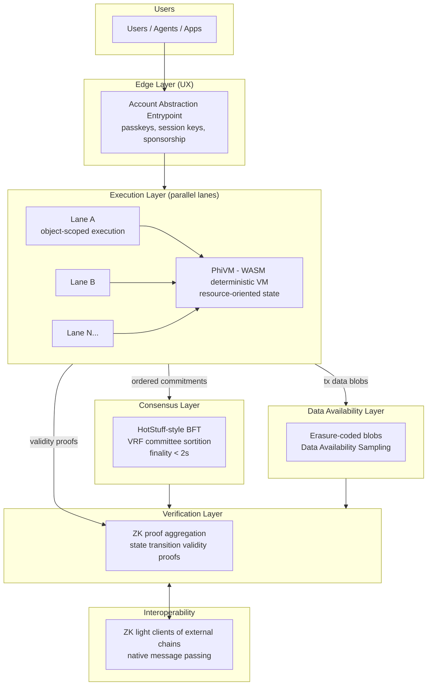

# Phi Protocol Specification (v0.1 Draft)

> **Status:** Design draft. Everything here is intended to be iterated on.
> **Companion docs:** [ARCHITECTURE.md](./ARCHITECTURE.md), [ROADMAP.md](./ROADMAP.md)

---

## 1. Name, Vision, and How It Improves on Web3

**Name:** Phi

Phi's consensus and security is governed by an internal protocol named
**Cargo** — the pipelined BFT engine, sortition, slashing, and security rules
described in Sections 3 and 12.

**Vision:** A modular, agent-centric blockchain that feels like a modern web
app to users, scales horizontally like a distributed database, and remains
verifiable end-to-end with zero-knowledge proofs. Phi treats *global
consensus as a scarce resource*: most activity happens in parallel, locally
validated execution lanes, and only succinct commitments are globally ordered.

**How it improves on today's Web3:**

| Pain point today | Phi answer |
|---|---|
| High fees, low throughput | Parallel object-based execution + ZK-compressed settlement; fee-free lane for rate-limited transactions |
| Seed phrases, gas UX | Native account abstraction, passkey (WebAuthn) signers, session keys, fee sponsorship at protocol level |
| Validator centralization | Committee rotation via VRF sortition, stake caps with quadratic-ish weighting, light-client-first design |
| Bridge hacks | Native ZK light-client interop; no multisig bridges |
| Energy waste | BFT Proof-of-Stake; no mining |
| All-public ledgers | Default-shielded balances with viewing keys; selective disclosure |
| EVM lock-in | WASM-based deterministic VM with Move-style resource semantics; optional EVM compatibility layer later |

---

## 2. High-Level Architecture

Key idea: **separation of ordering, execution, data availability, and
verification**. Validators order *commitments*; execution is parallel and
locally verifiable; ZK proofs make execution trust-minimized; DAS keeps data
available without every node storing everything.

---

## 3. Consensus Mechanism

**Choice:** Pipelined HotStuff-style BFT Proof-of-Stake with VRF committee
sortition — **Cargo**, Phi's governing security protocol.

- **Why BFT-PoS:** deterministic finality (sub-2-second), energy efficient,
  well-studied (Tendermint, HotStuff, Jolteon lineage), simple light clients.
- **Committee sortition:** Each epoch (~1 day), a Verifiable Random Function
  seeded by the previous epoch's randomness beacon selects an active committee
  (e.g., 200 validators) from the full validator set. This:
  - keeps message complexity bounded as the validator set grows,
  - makes targeted attacks (DoS, bribery) harder because the committee rotates,
  - allows tens of thousands of registered validators with modest hardware.
- **Pipelining:** Proposal, vote, and commit phases for consecutive blocks
  overlap (as in chained HotStuff), giving one block per network round trip.
- **Randomness beacon:** Threshold-BLS beacon produced by the committee;
  feeds VRF sortition and application randomness.
- **Slashing:** Double-sign and availability faults slash stake. Slashing is
  attributable and proven on-chain; whistleblowers earn part of the slash.
- **Trade-off:** BFT halts (rather than forks) when >1/3 of weighted committee
  is offline. We accept liveness loss over safety loss; a social-recovery
  governance path (Section 9) handles prolonged halts. Sortition introduces an
  adaptive-adversary window; mitigated by single-epoch committees, forward-secure
  keys, and proposer-secret self-election (Algorand-style) for block proposal.

---

## 4. Execution Environment / Virtual Machine

**PhiVM** — a deterministic WASM-based VM with **resource-oriented semantics**
(inspired by Move) and **object-scoped parallelism** (inspired by Sui/Solana's
access lists, generalized).

- **WASM core:** mature toolchains, sandboxing, metering, multiple source
  languages (Rust first-class; AssemblyScript/Go later). Determinism enforced
  by stripping floats/NaN nondeterminism, fixed memory/page limits, and gas
  metering at the instruction level.
- **Resource types:** Assets are linear types — they cannot be copied or
  implicitly dropped, eliminating entire classes of bugs (re-entrancy double
  spends, accidental burns). Enforced by the PhiVM ABI and the standard
  library, verified at module-publish time by a bytecode verifier.
- **Object model:** All state lives in *objects* with explicit ownership:
  - `Owned(account)` — single-writer; processed without global ordering
    (fast path, no consensus contention).
  - `Shared` — multi-writer; requires consensus ordering, executed in
    parallel when access sets are disjoint (optimistic STM with deterministic
    re-execution fallback).
  - `Immutable` — freely readable by anyone.
- **Declared access sets:** Transactions declare read/write object sets;
  the scheduler runs disjoint transactions in parallel across cores and lanes.
- **Formal-verification friendliness:** the standard library and core modules
  are written in a Rust subset amenable to Kani/Prusti verification; the
  bytecode verifier rules are small and specified formally.
- **Trade-off:** No EVM compatibility at launch. Justification: EVM's global
  shared-state model defeats parallelism and resource safety. A later EVM
  compatibility lane (transpiler or zkEVM module) can be added for migration.

---

## 5. State Model and Data Structures

- **Global state:** a versioned **Sparse Merkle Tree (SMT)** keyed by
  `ObjectID = H(creator, nonce)`, mapping to object payloads. SMT gives
  compact inclusion *and* exclusion proofs (needed for light clients and ZK
  circuits) and is friendly to incremental updates.
- **Objects:** `{ id, version, owner, type_tag, contents, metadata }`.
  Versioning gives optimistic-concurrency semantics and cheap conflict
  detection.
- **Blocks:** carry (a) ordered transaction *commitments* + access-set
  digests, (b) DA blob references, (c) state root after execution, (d) BFT
  quorum certificate, (e) optional aggregated validity proof.
- **History:** full tx data lives in the DA layer (erasure-coded blobs with
  KZG commitments). Validators and light nodes sample; archival nodes store.
  State sync uses SMT snapshots + proof-verified deltas — new nodes do **not**
  replay history.
- **Hash function:** BLAKE3 for general hashing (fast, parallel); a
  SNARK-friendly hash (Poseidon2) inside ZK circuits. Dual-hash trade-off:
  extra complexity vs. orders-of-magnitude cheaper proving.

---

## 6. Account Model (Native Account Abstraction)

Every account **is a smart contract** — there are no protocol-privileged
externally-owned accounts.

- **Default account module** ships with the protocol and supports:
  - **Passkey/WebAuthn signers** (P-256) — users onboard with FaceID/fingerprint;
    no seed phrase ever shown.
  - **Session keys** — scoped, expiring keys so apps don't prompt per action
    (kills signing fatigue).
  - **Social/threshold recovery** — M-of-N guardians (devices, contacts,
    institutions) can rotate the signer after a time delay.
  - **Spending policies** — daily limits, allow/deny lists, time locks.
  - **Key rotation & algorithm agility** — signature scheme is a pluggable
    account-level choice → clean migration path to post-quantum schemes
    (ML-DSA/Dilithium, SLH-DSA/SPHINCS+) without a hard fork.
- **Fee sponsorship is protocol-native:** any transaction may carry a sponsor
  signature; dApps, employers, or the protocol's free lane pay fees. No
  ERC-4337-style bolt-on bundlers needed.
- **Human-readable names** via an on-chain name registry object type.

---

## 7. Transaction Lifecycle and Fee Model

**Lifecycle:**

1. **Intent** — user/app constructs a transaction: access sets, payload,
   account auth (passkey/session key), optional sponsor.
2. **Admission** — edge nodes validate auth + access sets, route to the lane
   owning the touched objects.
3. **Fast path (owned objects only):** lane executes immediately; a
   certificate of execution is gossiped; consensus only checkpoints the lane
   root. Latency: ~sub-second.
4. **Consensus path (shared objects):** transaction commitment is ordered by
   Cargo; deterministic parallel execution follows ordering.
5. **Finalize** — state root updated; receipt with inclusion proof returned;
   data blob persisted to DA; periodically a ZK validity proof aggregates many
   blocks for light clients and interop.
6. **Reversibility window (opt-in):** account policies may route transfers
   through a `PendingTransfer` object with a challenge delay (e.g., 24h),
   enabling fraud reversal *by the owner's policy* — never by validators.
   Core ledger immutability is untouched.

**Fee model (three tiers):**

| Tier | Who | Cost | Mechanism |
|---|---|---|---|
| Free lane | humans w/ rate limits | 0 | Per-account regenerating quota ("mana") proportional to small stake or proof-of-personhood attestation; prevents spam without fees |
| Standard | most txs | near-zero, predictable | EIP-1559-style base fee per lane (burned) + tiny tip; multidimensional gas (compute, state, DA bytes) so one hot resource doesn't price out others |
| Priority | latency-sensitive | market | Sealed-bid priority auction per lane to blunt harmful MEV |

**MEV mitigation:** threshold-encrypted mempool — transactions are encrypted
to the committee and only decrypted after ordering, removing front-running at
the protocol level. Trade-off: ~1 round of extra latency on the consensus path.

---

## 8. Tokenomics and Incentive Design

**Token:** `PHI`.

- **Issuance:** disinflationary tail emission (e.g., starts ~5%/yr, decays to
  ~1%/yr floor) paying validators and the DA/storage market. Tail emission is
  an explicit trade-off: mild dilution buys *permanent* security budget instead
  of relying solely on fee markets (Bitcoin's long-term problem).
- **Fee burn:** standard-lane base fees are burned, linking usage to scarcity.
- **Staking:**
  - Validator self-bond minimum + delegation.
  - **Effective-stake curve:** voting weight grows sub-linearly above a cap
    threshold (concave), so mega-validators gain little from concentrating
    stake; encourages stake spreading. (Sybil-splitting is rational but yields
    more independent failure domains, which is the actual goal.)
  - Delegators share slashing risk → they police validators.
- **Storage is paid, not free:** state rent via *storage deposits* — locked
  PHI refunded when objects are deleted. Prevents unbounded state growth.
- **Contributor/builder rewards:** a fixed slice of emission funds public
  goods via governance-directed retroactive funding rounds.
- **Bootstrapping security (Issue 5):** see Section 12, point 5.

---

## 9. Governance Model

- **Bicameral, anti-plutocratic:**
  - **Stake house** — token-weighted with the same concave weighting curve.
  - **Citizen house** — one-person-one-vote among proof-of-personhood-attested
    accounts (multiple attestation providers; no single biometric monopoly).
  - Protocol upgrades require both houses; parameter tweaks need only one with
    a veto window for the other.
- **Time-locked execution:** all governance actions execute after a delay,
  giving users an exit window.
- **Constitution layer:** a small set of invariants (no balance edits, no
  retroactive slashing, supply schedule) require a supermajority of both
  houses + long delay — practically immutable.
- **Futarchy-lite signal markets** (optional, advisory) for contested
  parameter changes.
- **Emergency halts:** a security council can *pause* (never modify) specific
  modules for ≤72h with public justification; pauses auto-expire.

---

## 10. Privacy Mechanisms

- **Default-shielded balances:** account balances and transfer amounts use a
  note-commitment model (Zcash Sapling/Orchard lineage) with Poseidon2-based
  commitments; transfers prove validity in zero knowledge.
- **Transparent mode:** contracts and accounts can opt into transparent state
  (DeFi composability often needs it). Composability between shielded and
  transparent pools is explicit and auditable.
- **Viewing keys & selective disclosure:** users hand auditors/tax authorities
  scoped viewing keys; businesses can prove statements ("balance ≥ X",
  "funds not from sanctioned set") via ZK attestations without revealing more.
- **Private smart contract state** (later phase): per-contract encrypted state
  with ZK state-transition proofs; realistic scoping — general private
  computation ships *after* shielded payments are hardened.
- **Trade-off acknowledged:** shielded-by-default raises regulatory friction;
  selective disclosure + opt-out transparency is the deliberate middle path.

---

## 11. Interoperability Design

- **No multisig bridges, ever.** All cross-chain trust is cryptographic:
  - **Inbound:** ZK light clients verify external consensus (e.g., Ethereum
    sync-committee proofs, Tendermint-style headers) inside PhiVM circuits.
  - **Outbound:** Phi's aggregated validity proofs + BFT light-client
    proofs are cheap to verify on other chains (constant-size SNARKs).
- **Native message-passing standard** (IBC-inspired): ordered, authenticated
  channels between Phi objects and external chain contracts; assets move
  by lock/mint with proofs, or burn/release.
- **Internal interop is trivial:** lanes share one security domain and one DA
  layer, so "cross-shard" calls are just ordered messages — no bridges between
  lanes.

---

## 12. Security Model and Threat Analysis

**Assumptions:** ≤1/3 Byzantine weighted stake in any epoch committee;
standard cryptographic hardness (discrete log / lattice for PQ track);
partially synchronous network.

| Threat | Mitigation |
|---|---|
| Long-range attacks | Checkpointing via light-client trust roots + weak subjectivity; forward-secure validator keys |
| Nothing-at-stake / cheap history rewrite on young chain | Bootstrap-phase **checkpoint anchoring**: epoch state roots are posted to an established chain (e.g., Ethereum) during the first years, borrowing its security until native stake matures; plus delayed unbonding (21d) and slashing |
| Validator cartels / censorship | Committee rotation, threshold-encrypted mempool (can't see what you censor), inclusion lists from a rotating proposer set |
| Smart-contract exploits | Resource types kill double-spend/re-entrancy classes; bytecode verifier; capability-based authority instead of ambient `tx.origin`-style checks; module upgrade governed by per-module policy with timelocks |
| Phishing/scams | Human-readable signing (typed intents rendered by wallets from on-chain ABI metadata), spending limits, opt-in reversible transfers, name registry with anti-spoofing rules |
| MEV extraction | Encrypted mempool + per-lane sealed-bid priority auctions |
| DA withholding | Erasure coding + data availability sampling; blocks invalid without availability attestations |
| Quantum adversary (future) | Hash-based commitments already PQ; account-level signature agility → ML-DSA migration; STARK-friendly proof path keeps verification PQ-safe |
| Governance capture | Bicameral houses, concave stake weighting, constitution invariants, timelocks |

**Attack-surface reduction principles:** smallest possible trusted core
(ordering + verifier), everything else proven; no privileged precompiles
without circuit equivalents; all protocol upgrades themselves go through the
VM and governance.

---

## 13. How Phi Patches Each of the 10 Issues

1. **Scalability & Cost** — Owned-object fast path needs no global consensus;
   shared-object txs execute in parallel via declared access sets across
   horizontally added lanes; DA sampling decouples bandwidth from node count;
   ZK aggregation compresses verification. Realistic target: ~10k TPS on the
   consensus path per committee + ~100k+ TPS aggregate across lanes/fast path
   under benign workloads. (Stated honestly: 100k+ sustained *global shared
   state* TPS is not credible on any design; Phi achieves it by making
   most traffic *not need* global ordering.) Fees: free lane + burned base
   fees keep standard txs near zero.
2. **User Experience** — Passkeys, no seed phrases, session keys, protocol
   fee sponsorship, human-readable intents, sub-second fast-path latency.
3. **Centralization** — VRF committee sortition with modest hardware
   requirements, concave stake weighting, light-client-first protocol so users
   never need trusted RPC monopolies, citizen house in governance.
4. **Security & Immutability** — Linear resource types, bytecode verification,
   encrypted mempool, opt-in account-level reversibility windows that never
   compromise ledger immutability, formal-verification-friendly core.
5. **Bootstrapping & Economic Security** — Checkpoint anchoring to an
   established chain during infancy, delayed unbonding, slashing from genesis,
   tail emission guaranteeing a perpetual security budget.
6. **Interoperability** — Native ZK light clients in both directions; no
   multisig bridges; internal lanes share one security domain.
7. **Energy & Sustainability** — BFT PoS; ordinary-server validators; storage
   deposits bound state growth.
8. **Privacy** — Default-shielded balances, viewing keys, selective ZK
   disclosure, opt-in transparency for composability.
9. **Developer Friction** — Rust→WASM with a typed object/resource standard
   library, local single-binary devnet, deterministic replay debugging,
   built-in test framework; no EVM lock-in, with a migration lane planned.
10. **Full-Stack Vision** — DID-compatible identity from account abstraction +
    name registry + personhood attestations; DA layer doubles as short-term
    data publication; storage-deposit model + blob market covers persistent
    storage; randomness beacon, names, and messaging are native objects, not
    external protocols.

---

## 14. Explicit Trade-offs Summary

- **Liveness over forking:** BFT halts under >1/3 faults — chosen over
  fork-based "availability" because silent forks are worse for users.
- **No EVM at launch:** parallelism + resource safety over instant ecosystem
  compatibility; mitigated by a planned compatibility lane.
- **Dual hash functions:** engineering complexity in exchange for practical
  ZK proving costs.
- **Tail emission:** mild perpetual dilution in exchange for a permanent
  security budget.
- **Shielded by default:** regulatory friction in exchange for meaningful
  privacy; softened with selective disclosure.
- **Encrypted mempool:** ~1 round extra latency on the consensus path in
  exchange for structural MEV resistance.
